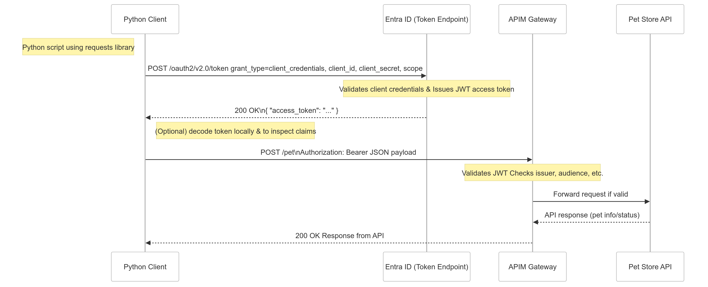

# OAuth Flow Diagram

Below is the OAuth flow diagram as an PNG:



And here is the Mermaid source code used to generate the diagram as code that could be changed and visualized using Mermaid live editor:

```mermaid
sequenceDiagram
    autonumber
    title OAuth Flow: Python Client -> Entra ID -> APIM -> Pet Store API

    participant C as Python Client
    participant AD as Entra ID (Token Endpoint)
    participant APIM as APIM Gateway
    participant API as Pet Store API

    Note left of C: Python script using requests library
    C->>AD: POST /oauth2/v2.0/token grant_type=client_credentials, client_id, client_secret, scope
    Note over AD: Validates client credentials Issues JWT access token
    AD-->>C: 200 OK { "access_token": "..." }

    Note right of C: (Optional) decode token locally\nto inspect claims
    C->>APIM: POST /pet Authorization: Bearer <access_token> JSON payload
    Note over APIM: Validates JWT Checks issuer, audience, etc.
    APIM->>API: Forward request if valid
    API-->>APIM: API response (pet info/status)
    APIM-->>C: 200 OK\nResponse from API
